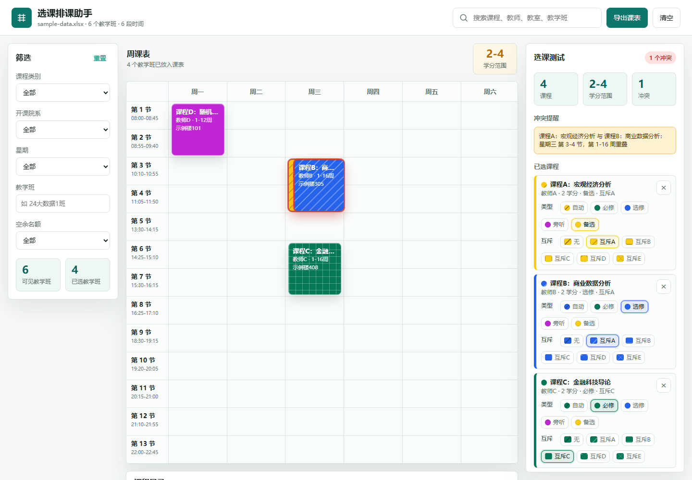

# 选课排课助手

一个本地选课排课测试工具。把教务系统导出的教学任务表格转换成可点击的周课表，用来模拟选课组合、检查时间冲突、标记课程类型，并导出自己的课表。

> 仓库中的 `src/data.js` 只包含匿名示例数据，不包含真实课程、教师、教室或个人选课信息。



## 功能

- 按课程名、教师、教室、教学班搜索课程。
- 按课程类别、开课院系、星期、空余名额筛选。
- 点击“加入 / 移除”测试不同选课组合。
- 自动检测星期、节次、周次同时重叠的时间冲突。
- 在右侧查看已选课程、冲突提醒和课程详情。
- 用颜色标记课程类型：必修、选修、旁听、备选。
- 用纹理标记互斥关系：互斥 A-E 支持斜线、横线、网格、点纹、棋盘纹理。
- 总学分按课程类型显示为区间：最低值只计入必修，最高值计入必修和选修；旁听、备选不计入。
- 导出当前已选课表为独立 HTML 文件，方便打印或另存为 PDF。

## 快速开始

直接打开 `index.html` 可以查看匿名示例数据。

使用自己的课程数据：

1. 从教务系统导出教学任务表格，格式为 `.xls` 或 `.xlsx`。
2. 把表格放入 `data/raw/`。
3. 安装依赖：

```bash
pip install pandas xlrd openpyxl
```

4. 运行解析脚本：

```bash
python scripts/parse_courses.py
```

5. 重新打开或刷新 `index.html`。

解析脚本会读取 `data/raw/` 下的表格，生成新的 `src/data.js`。如果多次导入同一教学任务，会按课程序号自动去重；同一课程的不同教学班不会被合并。
